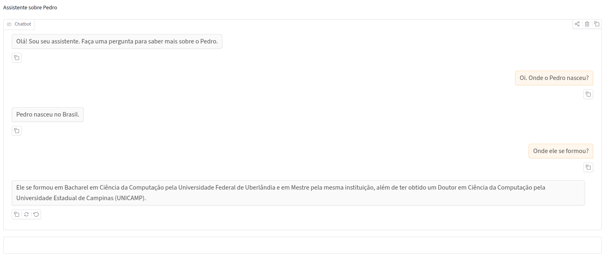

# Digital Twin Assistant

The Digital Twin Assistant is a containerized Retrieval-Augmented Generation (RAG) application that lets users interact with a digital representation of a person’s profile.

It processes profile documents, generates embeddings with Ollama, stores them in ChromaDB, retrieves relevant context, and produces answers through LangChain and a local LLM. The application provides a Gradio interface, persistent storage, Prometheus metrics, and Grafana dashboards.

## Screenshots

| | |
| :---: | :---: |
|   |  |


## Prerequisites

* Ubuntu
* Ollama
* Docker and Docker Compose
* `uv` for local development and tests
* Terraform for Grafana dashboard provisioning

## Project Directory

Download or Clone the repository and enter its root directory:

```bash
cd digital-twin
```

Unless otherwise stated, run all Docker, `uv`, and test commands from the project root, where `docker-compose.yaml` and `pyproject.toml` are located.

## Configuration

Create the Docker environment file:

```bash
cp .env.docker.example .env.docker
```

Update its values according to your environment.

The document used for RAG can be stored in the `documents` folder.

## Install Ollama and Models

```bash
curl -fsSL https://ollama.com/install.sh | sh

ollama pull qwen3-embedding:0.6b
ollama pull qwen3:1.7b
```

Verify the installed models:

```bash
ollama list
```

## Configure Ollama for Docker

Allow containers to access Ollama:

```bash
sudo systemctl edit ollama
```

Add:

```ini
[Service]
Environment="OLLAMA_HOST=0.0.0.0:11434"
```

Restart Ollama:

```bash
sudo systemctl daemon-reload
sudo systemctl restart ollama
```

## Install Docker and Docker Compose

```bash
sudo install -m 0755 -d /etc/apt/keyrings

curl -fsSL https://download.docker.com/linux/ubuntu/gpg \
  | sudo gpg --dearmor -o /etc/apt/keyrings/docker.gpg

echo \
  "deb [arch=$(dpkg --print-architecture) signed-by=/etc/apt/keyrings/docker.gpg] \
  https://download.docker.com/linux/ubuntu \
  $(. /etc/os-release && echo "$VERSION_CODENAME") stable" \
  | sudo tee /etc/apt/sources.list.d/docker.list > /dev/null

sudo apt update

sudo apt install -y \
  docker-ce \
  docker-ce-cli \
  containerd.io \
  docker-buildx-plugin \
  docker-compose-plugin
```

## Run with Docker

```bash
sudo docker compose up --build
```

Services:

* Application: `http://127.0.0.1:7860`
* Grafana: `http://127.0.0.1:3000`
* Prometheus: `http://127.0.0.1:8000`

Stop the services:

```bash
sudo docker compose down
```

## Local Development

Install `uv`:

```bash
curl -LsSf https://astral.sh/uv/install.sh | sh
source ~/.bashrc
```

Install dependencies:

```bash
uv sync
```

Run the tests:

```bash
uv run pytest
```

A valid `.env` file is required for local execution and testing.

## Provision Grafana Dashboards

From the Terraform configuration directory:

```bash
terraform init
terraform plan
terraform apply
```

Grafana must be running before applying the Terraform configuration.